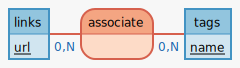

# Database modeling 1

## Kata

#### Introduction

A code kata is an exercise in programming which helps programmers hone their skills through practice and repetition: repeat this exercice every day during one week :)

#### It's all about concepts

I want a database to store links on my favorite websites. I want a collaborative tool: everybody can add links without authentication. I also want to associate tags to the links in order to make search more effective. Propose an entity/relationship schema (MCD) :)

Finished? Compare with my solution

#### One step further

Make the logical data model (MLD) corresponding to the conceptual data model in the previous step.
